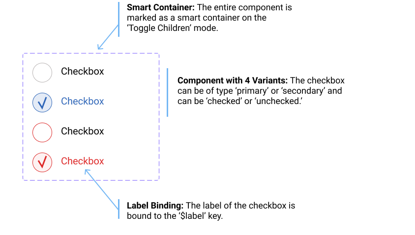

# Figma-low-Code Design System Example


[Figma-Low-Code](https://github.com/KlausSchaefers/figma-low-code) is an OpenSource project, that turns your **Figma** components into fully working **VUE** components. The low code approach reduces the hand-off between designers and developers, saves front-end code and ensures that the Figma design stays the **single source of truth**. Changes in the design, are instantly visible in your projects without changing a single line of code.


This repository serves as an example. More information about Fima-Low-Code can be found in [Figma-Low-Code repository](https://github.com/KlausSchaefers/figma-low-code).

You can find an example [here](https://klausschaefers.github.io/figma-design-system-example/)

# Development Guide

First clone this repo or add the `vue-lwo-code` package via NPM.


```sh
git clone https://github.com/KlausSchaefers/figma-designlets-example.git

or

npm install vue-low-code
```


Afterwards, load all dependecies with the following command

```sh
npm install
```

Finally start the server

```sh
npm run serve
```

To use the full power of Figma-Low-Code it is advised to install the [plugin](https://www.figma.com/community/plugin/858477504263032980/Figma-Low-Code), which
allows to define responsive behavior, inpput styles and data and method binding.

## Registering the design system
The DesignLet mode allows to turn your design system into Vue components that can be used as normal components. DesignLets are not limited to
simple components like buttons or text, but can also be compplex components like forms, dialogs and so on. The first step is
to *globally* register the designlets before any template is parsed. The easiest way is to register the designlets in the `main.js`file:

```javascript
import Vue from 'vue'
import App from './App.vue'
import './registerServiceWorker'
import router from './router'
import * as VueLowCode from 'vue-low-code'
import figmaDesign from './views/figma-design-system.json'
import quxDesign from './views/qux-design-system.json'

Vue.config.productionTip = false

/*
 * Make sure the design is registered before the App is mounted
 */
async function init () {
    // for live debuging use Figma.createFigmaDesignSystem(<FileID>, <AccessKey>)
  await VueLowCode.createFigmaDesignSystem(figmaDesign)

  new Vue({
    router,
    render: h => h(App)
  }).$mount('#app')
}

init()

```

You need to use your fileID and [API token](https://www.figma.com/developers/api#access-tokens) for the registration. Figma-Low-Code can now download the Figma design
and transform it into the designlets. This is ideal for iterative development, when the design frequently changes. After every page reload, that design is updated. However,
the Figma api is sometimes slow, so for production it is best to download the figma file and place it in the project. Downloading the file will improve performance and
will also ensure your project does not break after changes in the Figma file.


```bash
node download.js <api token> <file id>
```


## Using the Low Code Design System

Once the design system is registered, they can be used within any template in the application. Suppose there is primary button defined in the design system.
This can be invoked be simple using a tag with the corresponding name. Please make sure that the design system names do not clash with standard HTML elements, or other
components in your code base.

```vue
<PrimaryButton/>
```

For simple elements like boxes, rectangles or labels one can use the wrapped notion to replace the inner elements. An alternative is to use the label property

```vue
<PrimaryButton>Hello World</PrimaryButton>
<PrimaryButton label="Hello World"/>
```

For input elements, also the v-model element works. In addtion a placeholder and options element is supported

```vue
<PrimaryField v-model="user.name" placeholder="Enter a name"/>
<PrimaryDropDown v-model="user.job" :options="job" />
...
jobs = [
  {label: 'Developer', value:'deverloper'},
  {label: 'Designer', value:'designer'},
]

```


For Varient Components, you need to use properties to select the desired component style:

```vue
   /*
    * The type and state properties are defined in Figma.
    */
   <VarientButton type="Secondary" state="Out" />
   <VarientButton type="Primary" state="Out" label="Secondary Hover"/>

```


## Figma Plugin

To use the advanced low code features such as data & method binding or input widgets, you must install the  [Figma-Low-Code plugin](https://www.figma.com/community/plugin/858477504263032980/Figma-Low-Code).
The plugin has two main tab. The 'Low Code' tab allows you to set the basics, such as the element type, or the input and output data binding.


The 'Style' tab allows you to define, if the element should be fixed width or height. By default Figma Low Code will assume hat the widget is
responsive. Also, you can define hover styles for the fill, stroke and text color. For input elements focus styles can also be defined.


### Input Elements

By default Figma-Low-Code renders all elements of the design as box-ish (div, label, span) elements. Often this is not enough, and you
would like to allow the user to enter data. You can override the default rendering by specifying the desired element type, for instance
text fields or password fields. To do so:

1. Launch the Figma-Low-Code plugin
2. Select an element.
3. Select from a list of widgets type.

The 'Smart Container' is a special widget that allows you to build dynamic elements such as checkboxes or data grid. Once selected,
you can choose between two modes of operation:

1. **Repeat Children**: All elements contained in the elements will be repeated n-times based on the data binding, which has to point to a array. This widget is ideal to build lists
of repeating items.
2. **Toggle Children**: The visibility of the child widgets will be toggled on user clicks. For instance in a checkbox, the hook indicator would be shown after a click and hidden after a second click. For Varient Components the behavior is slightly different. In this case the system will toggle between the child components.


A good example might be a checkbox, whcih can be toggled. The checkbox has two states, 'selected' abd 'unselected', and in addition a 'Primary' and 'Secondary' varient. The outer component is marked as a 'Smart Container' with 'Toggle Children'




To use this component as an working checkbox in Vue, use the following snippet:

```vue
   /*
    * The varient component has two children with the type == secondary.
    * The component will toggle between them on user clicks
    */
   <VarientCheckBox type="Secondary" label="Tick me"/>

```

### Data and Method Binding

Figma-Low-Code Design Systems are not limited to simple components like buttons or text, but can also be compplex components like forms, dialogs and so on.
Usually one has to use data and method binding ([Details](##define-data-binding-and-callbacks)) in this situations to populate the elements with data.
The relevant (child) elements have to be wired to the right data and the right actions have to be defined. For instance in a login dialog, the email field needs to be
wired to the `email` variable and the password field to the `password` variable. The button needs to get a method binding for the `login` method. When the
user clicks in the button, and 'login' event will be fired, which can be used using the standard '@' notation. Please note, that when a component consist out of more than one shapes, it is not possible infer where the label text should be shown. One has to specify a magic data binding (`$label`). The wiring of the login dialog would look like


The code would be

```vue
<LoginDialog v-model="loginData" label="Enter your credentials" @login="myLoginMethod">

...
loginData = {
  email: '',
  password: ''
}

....

myLoginMethod () {
  // your code
}
```

You can find an example [here](https://klausschaefers.github.io/figma-design-system-example/)


# Background: Two ways of using Figma-Low-Code

Figma-Low-Code provides two modes of operation.
1. The first mode is the 'Full' low code mode. The Figma design is entirely rendered and wired to the
business logic. The front-end developers will usually do little UI customization and  focus on backend connectivity and business logic.
2. The second mode is the so called 'Design System' mode, which turns your design system into Vue components. The developers can simply use these as any other VUE component within their projects.


The full mode will in general result to a faster development experience, however the developers have less control over the front end. The
'Design System' mode speeds up development and helps to implement design systems. Please note, that both approaches will maintain the Figma or Quant-UX
design as the single source of truth. Design channges will be instantly visible in the application.


# Credits

Figma-Low-Code is based on vue-low-code developed by [Quant-UX](https://quant-ux.com).
